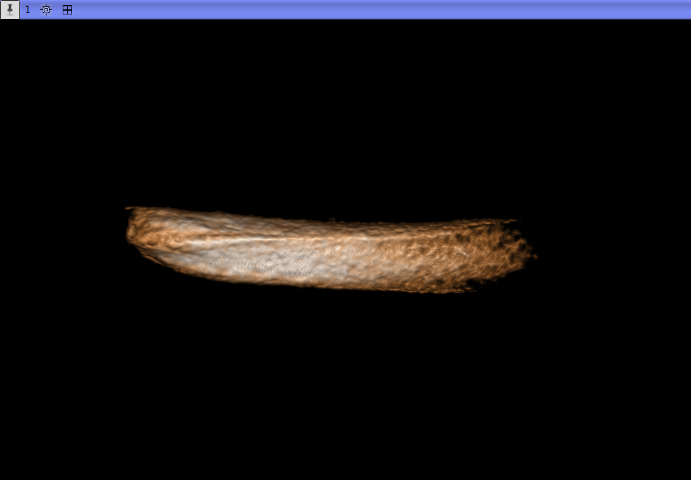
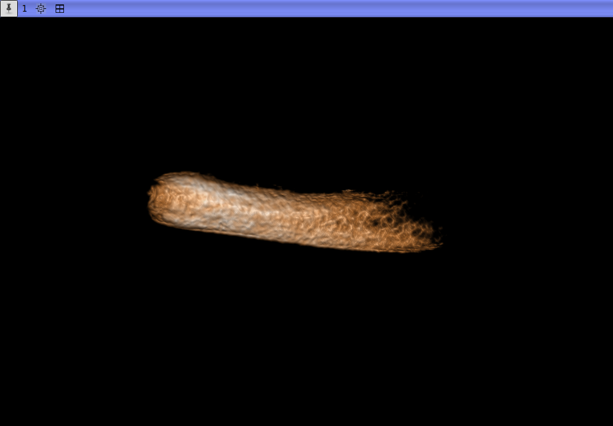

## MorphoDepot Repository
Repository for segmentation of a specimen scan.  See [this JSON file](MorphoDepotAccession.json) for specimen details.
* Species: Mus musculus
* Modality: Micro CT (or synchrotron)
* Contrast: No
* Dimensions: (280, 168, 234)
* Spacing (mm): (0.00592, 0.00592, 0.00592)

## Screenshots

_Mouse_P0_Incisor_
